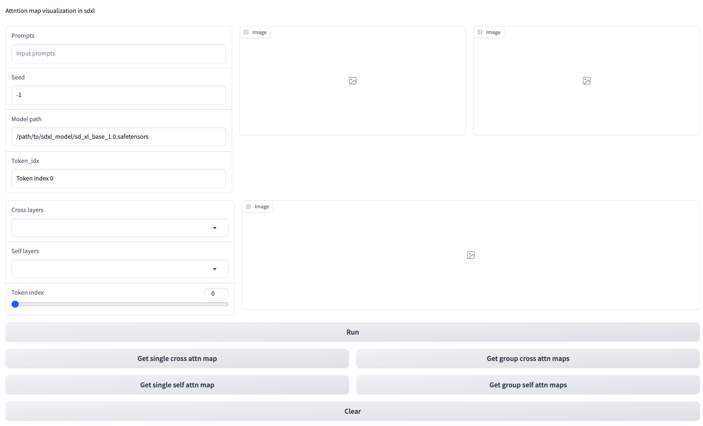
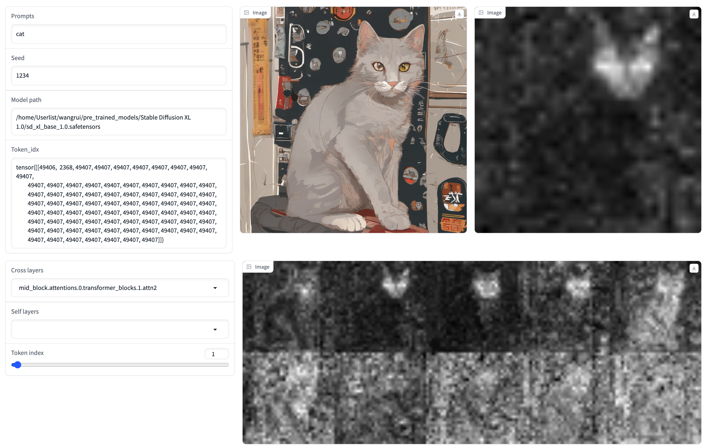

# A gradio tool for visualizing attention maps in SDXL

## Prerequisites
1. Install dependencies >> requirement.txt
2. python sdxl_attn_visualizer_gradio.py

## Usage

1. Input the prompt and choose the path of sdxl model (format: .safetensors).
2. Click "Run" button.
3. Choose the layer and token_idx for visualization.
4. The "group attn maps" means the attention maps in the same block.
5. Clear button will clear both model and attention map cache. 

## Demo

